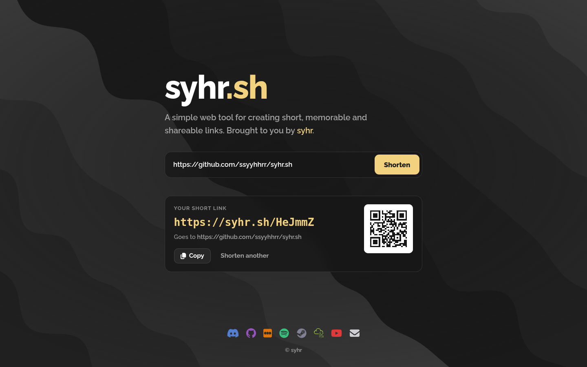

# syhr.sh

A simple web tool for creating short, memorable and shareable links. Paste a long link, press
**Shorten**, and get `https://syhr.sh/Ab3dE9`, with Copy, Share and a QR code. No sign-up.

<p>
  
  
</p>

## What it does

- **Shortens links** to 6-character slugs on the site's domain. The same URL always gets the same
  link, however it's typed (`example.com` and `https://EXAMPLE.com/` are one link).
- **Redirects** `/<slug>` (and the old `/<slug>/`) to the stored URL. Unknown slugs get a friendly
  404 page with the form on it.
- **Refuses abuse**, with a message saying why:
  - links back to syhr.sh (redirect loops);
  - non-web schemes;
  - private or local addresses;
  - URLs with credentials in them;
  - other public shorteners;
  - domains the owner has blocked.
- **Rate-limits** link creation per client (10 a minute, 100 a day by default). Redirects are
  never limited.
- **Works without JavaScript.** The form posts to the server and gets the result back. With
  JavaScript you also get the animated wave background, Copy, Share and a QR code.
- **Keeps no tracking data:** no click counts, and no IP addresses stored or logged.
- **An admin command (`syhr`)** adds custom slugs, lists and deletes links, and blocks domains.

The full behaviour is specified in [docs/spec.md](docs/spec.md). Why things are the way they are is
in [docs/decisions.md](docs/decisions.md).

## Running it locally

You need Node.js 24 or newer.

```sh
npm ci
npm run build      # bundles the browser script, styles and fonts into dist/
PUBLIC_URL=http://localhost:4000 npm start
```

Then open http://localhost:4000. The database is created at `./data/syhr.db`. Without
`PUBLIC_URL`, the links the app hands out point at `https://syhr.sh`.

### Configuration

All settings are environment variables. Invalid values stop the app at start-up with a message
naming them.

| Variable                | Default           | Meaning                                                                  |
| ----------------------- | ----------------- | ------------------------------------------------------------------------ |
| `PORT`                  | `4000`            | Port to listen on                                                        |
| `HOST`                  | `0.0.0.0`         | Address to listen on                                                     |
| `PUBLIC_URL`            | `https://syhr.sh` | Origin short links are built on; links to it are refused                 |
| `DATABASE_PATH`         | `./data/syhr.db`  | SQLite file, created if missing (`/data/syhr.db` in Docker)              |
| `TRUST_PROXY`           | unset             | `1` to read the client's IP from `X-Forwarded-For` (behind a proxy only) |
| `RATE_LIMIT_PER_MINUTE` | `10`              | Links one client may create per minute                                   |
| `RATE_LIMIT_PER_DAY`    | `100`             | Links one client may create per day                                      |

### The admin command

```sh
npm run cli -- links add https://google.com --slug kachow   # custom slug
npm run cli -- links list --search example --limit 50
npm run cli -- links delete kachow
npm run cli -- domains block evil.example                   # also deletes its links
npm run cli -- domains unblock evil.example
npm run cli -- domains list
npm run cli -- help
```

It reads the same `DATABASE_PATH` and `PUBLIC_URL` as the server. Changes take effect for visitors
immediately, with no restart. In Docker it's on the `PATH`: `docker exec syhrsh syhr links list`.

## Testing

```sh
npm test           # everything: typecheck, lint, format check, build, unit + API tests, e2e
```

Or piece by piece:

| Command                   | What it runs                                                                |
| ------------------------- | --------------------------------------------------------------------------- |
| `npm run typecheck`       | `tsc` for the Node, browser and end-to-end code, each with its own globals  |
| `npm run lint`            | ESLint with typescript-eslint's strictest type-aware rules                  |
| `npm run format:check`    | Prettier (`npm run format` fixes)                                           |
| `npm run test:unit`       | Vitest: pure logic in `tests/unit`, HTTP app, store and CLI in `tests/api`  |
| `npm run test:e2e`        | Playwright: the real server in Chromium at desktop and phone sizes          |
| `npm run test:e2e:legacy` | The same e2e suite against the pre-overhaul app, extracted from git history |

- Set `E2E_WEBKIT=1` to add WebKit (Safari's engine) to the e2e run, after
  `npx playwright install webkit`. CI always does.
- `npm run fixtures:legacy` re-records `tests/fixtures/legacy-shorten.json` from the old app.
- `npm run screenshots` regenerates the images above from the real app.

## Deploying

The intended setup is one container behind a reverse proxy on the same host, with the database on
a volume. [`compose.yaml`](compose.yaml) is a working example:

```sh
docker compose up -d
docker exec syhrsh syhr links list
```

Point the proxy at `127.0.0.1:4000`. For example, with Caddy:

```
syhr.sh {
    reverse_proxy 127.0.0.1:4000
}
```

Keep `TRUST_PROXY=1` only while the proxy is the sole way in. It makes the app trust the
proxy's `X-Forwarded-For` header when rate-limiting.

To build the image yourself: `docker build -t syhrsh .` (`--build-arg NODE_IMAGE=...` swaps the
Node base image, for example to pin a digest). `node scripts/docker-smoke.ts syhrsh` checks a built
image end to end.

**CI and publishing.** `.github/workflows/ci.yml` runs every check on every push, including WebKit.
It then builds and smoke-tests the Docker image. On pushes to `main` it publishes
`syhr/syhrsh:latest` and `syhr/syhrsh:sha-<commit>` for amd64 and arm64. Publishing needs two
repository secrets, `DOCKERHUB_USERNAME` and `DOCKERHUB_TOKEN` (a Docker Hub access token with
write access); until they're set, that step is skipped.

## How it's laid out

```
src/
  core/      Pure logic, no I/O: URL rules, slugs, rate limiting, config, waves, QR, CLI parsing
  server/    HTTP (Hono), SQLite store, page rendering, assets, logging, start-up
  cli/       The `syhr` admin command
  browser/   The page's script (waves, form, QR) and stylesheet
  content/   The page's words and profile links
public/      Files served as-is (favicon)
scripts/     Build, screenshots, Docker smoke test, fixture recorder
tests/       unit/ and api/ (Vitest), e2e/ (Playwright), fixtures/ (generated), support/
docs/        Spec, decisions, screenshots
```

Everything is TypeScript, run directly by Node 24 (no compile step for the server) and bundled
by esbuild for the browser. There are two runtime dependencies: Hono and its Node adapter.

## License

MIT; see [LICENSE.txt](LICENSE.txt). Icons are from Font Awesome Free (CC BY 4.0) and Simple
Icons (CC0). Raleway is under the SIL Open Font License.

Made by [syhr](https://sy.hr).
